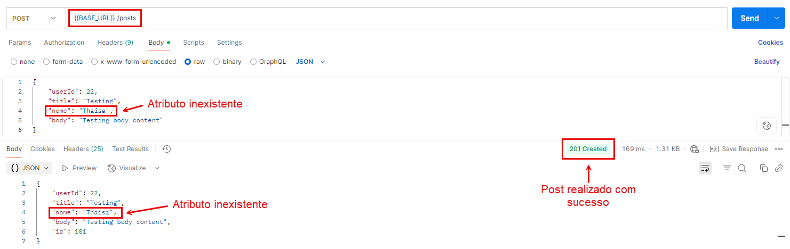
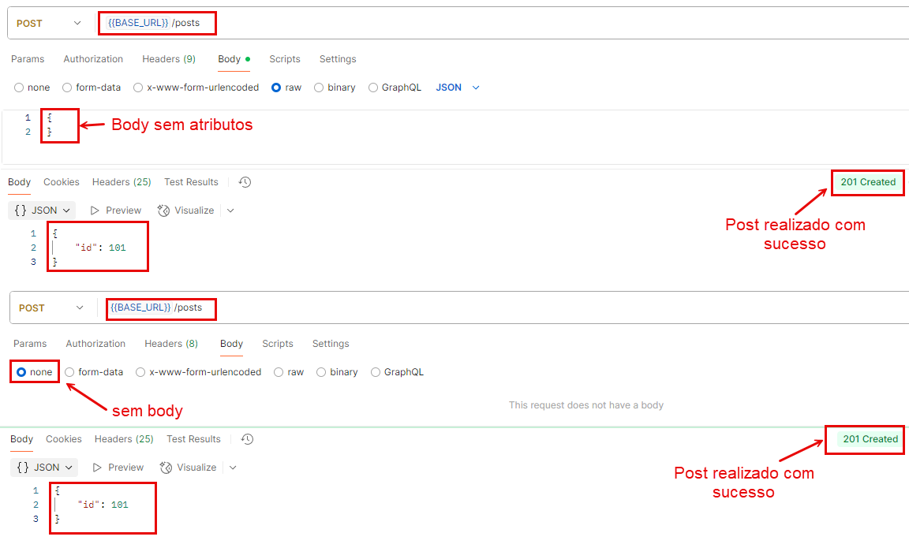
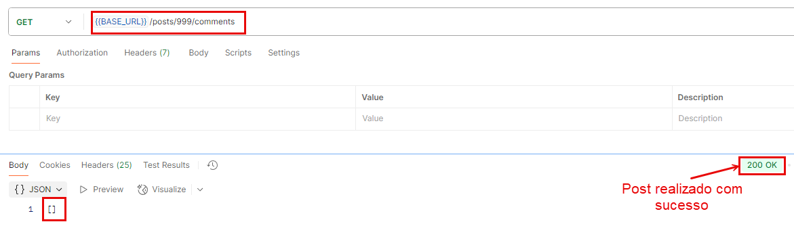
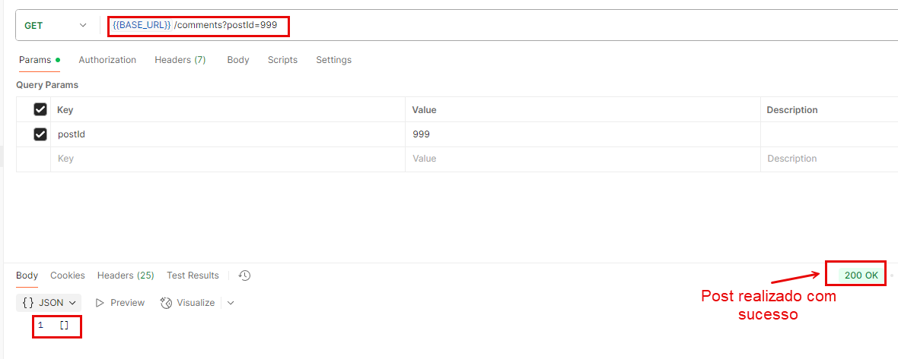
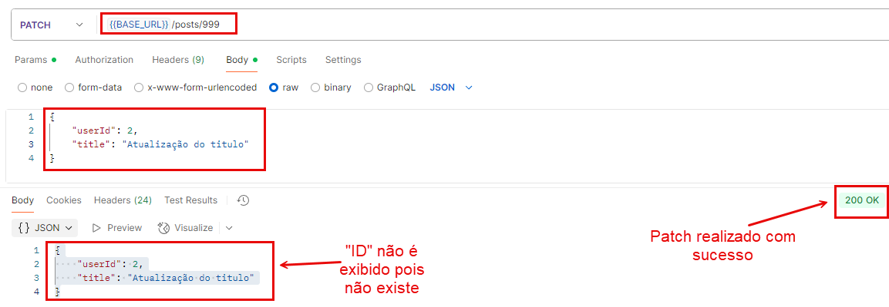
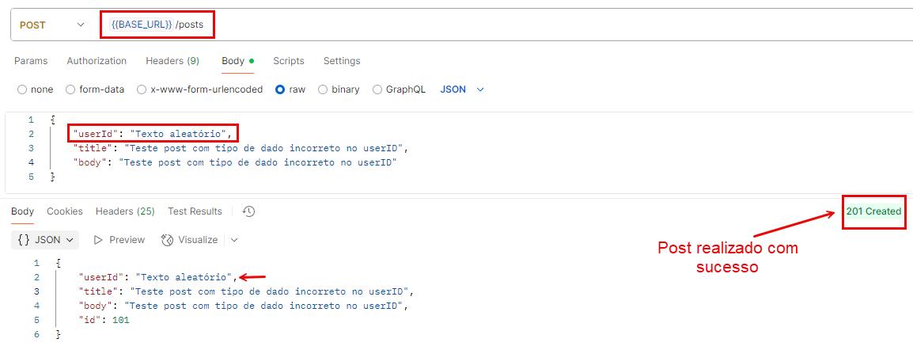
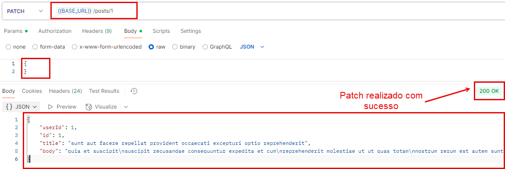
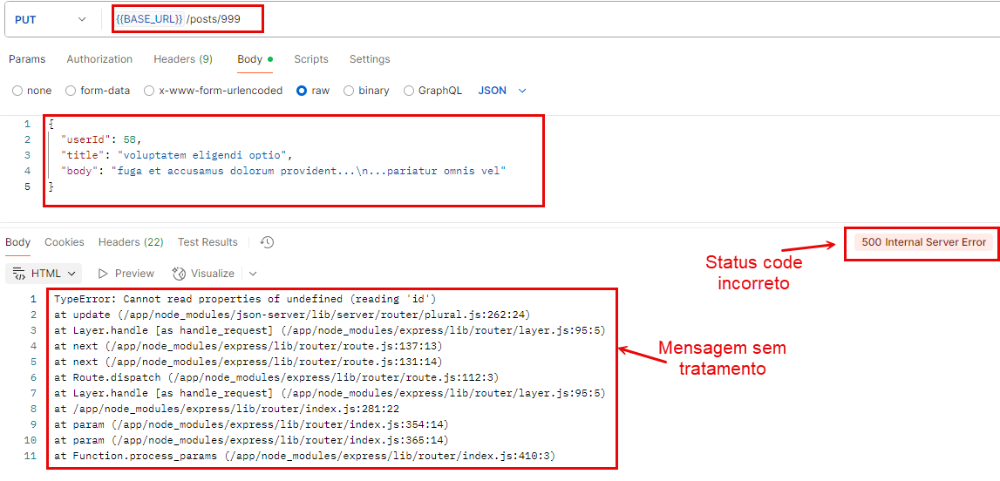
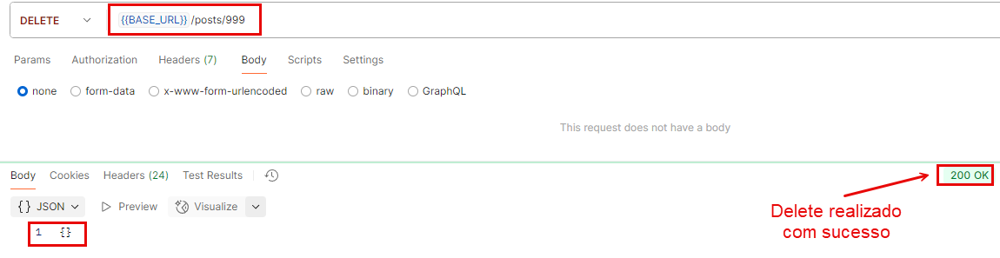

# 🐛 Documentação de Bugs

> (!) Nota: Sei que a API em questão é um mock, então alguns comportamentos inesperados são realizados somente para validação. Aqui é apenas um report de alguns comportamentos estranhos que encontrei e gostaria de pontuar como melhorias caso fosse cenário real.

---
## 📊 Resumo por Classificação

| Severidade | Prioridade | Bug ID | Cenário de Teste Automatizado |
|------------|------------|--------|-------------------------------|
| 🔥 Crítica | 🟧 Alta    | BUG 09 | [DELETE] - Deletando um registro inexistente |
| 🟧 Alta    | 🟧 Alta    | BUG 01 | [POST] - Realizando uma postagem com parâmetros extra não mapeados |
| 🟧 Alta    | 🟧 Alta    | BUG 06 | [POST] - Realizando uma postagem com tipo de dado incorreto |
| 🟨 Média   | 🟨 Média   | BUG 02 | [POST] - Realizando uma postagem sem atributos no body |
| 🟨 Média   | 🟨 Média   | BUG 05 | [PATCH] - Realizando uma atualização com ID inexistente |
| 🟨 Média   | 🟩 Baixa   | BUG 08 | [PUT] - Realizando uma atualização com ID inexistente |
| 🟩 Baixa   | 🟩 Baixa   | BUG 03 | [GET] - Busca por recurso aninhado - ID inexistente |
| 🟩 Baixa   | 🟩 Baixa   | BUG 04 | [GET] - Busca por parametro (query) - ID inexistente |
| 🟩 Baixa   | 🟩 Baixa   | BUG 07 | [PATCH] - Realizando uma atualização com body sem dados |

---
### [BUG 01]

**Informações:**  
- **Método:** POST  
- **URL:** https://jsonplaceholder.typicode.com/posts  
- **Body enviado:**
```json
{
    "userId": 22,
    "title": "Testing",
    "nome": "Thaisa", // Parametro novo não mapeado
    "body": "Testing body content"
}
```

**Problema:**  
Ao realizar a requisição com um parâmetro não mapeado (`nome`), em vez de retornar erro, o endpoint realiza o POST com sucesso, retorna status **201** e ainda traz esse novo atributo na resposta.



**Severidade:** 🟧 Alta (Risco de segurança e poluição de dados)  
**Prioridade:** 🟧 Alta (Violações de segurança devem ser tratadas rapidamente)  

**Por que é um problema:**  
Esse comportamento poderia gerar vulnerabilidades de segurança como Mass Assignment ou poluição na base de dados, pois aceita qualquer atributo inesperado sem validação.

**Descrição do cenário automatizado que possui esse comportamento:**  
[POST][BUG 01][Scenario 09] - Realizando uma postagem com parâmetros extra não mapeados
---
### [BUG 02]

**Informações:**  
- **Método:** POST  
- **URL:** https://jsonplaceholder.typicode.com/posts  
- **Body enviado:**
```json
{}
```

**Problema:**  
Ao realizar a requisição POST com o corpo vazio (sem nenhum dado no body ou sem nenhum atributo), o endpoint retorna status **201** (Created) com sucesso e gera um novo recurso, mesmo sem dados enviados.



**Severidade:** 🟨 Média (Causa inconsistência de dados, mas não quebra o sistema)  
**Prioridade:** 🟨 Média (Deve ser corrigido para garantir a integridade dos dados)  

**Por que é um problema:**  
Ao realizar a requisição POST com o corpo vazio, o endpoint retorna status 201 (Created) com sucesso e gera um novo recurso, mesmo sem dados enviados.

**Descrição do cenário automatizado que possui esse comportamento:**  
[POST][BUG 02][Cenario 10] - Realizando uma postagem sem atributos no body

---

### [BUG 03]

**Informações:**  
- **Método:** GET  
- **URL:** https://jsonplaceholder.typicode.com/posts/{id}/comments  
- **ID utilizado:** Inexistente (999)  

**Problema:**  
Ao realizar a requisição GET buscando comentários de um post com **ID inexistente**, o endpoint retorna status **200** (OK) com body vazio (`[]`), em vez de retornar um **404 Not Found**.



**Severidade:** 🟩 Baixa (Não causa erro, mas a resposta é ambígua)  
**Prioridade:** 🟩 Baixa (É uma melhoria de clareza da API, não um defeito funcional crítico)  

**Por que é um problema:**  
Esse comportamento pode gerar erros de lógica nos consumidores da API, pois não indica que o recurso principal (o post) não existe.

**Descrição do cenário automatizado que possui esse comportamento:**  
[GET][BUG 03][Cenario 11] - Busca por recurso aninhado - ID inexistente

---

### [BUG 04]

**Informações:**  
- **Método:** GET  
- **URL:** https://jsonplaceholder.typicode.com/comments?postId={id}  
- **Query utilizada:** postId inexistente (999)  

**Problema:**  
Ao realizar a requisição GET filtrando comentários pelo **postId inexistente**, o endpoint retorna status **200** (OK) com body vazio (`[]`), em vez de retornar um **404 Not Found**.



**Severidade:** 🟩 Baixa  
**Prioridade:** 🟩 Baixa  

**Por que é um problema:**  
Similar ao BUG 03, o comportamento pode confundir os consumidores da API, pois o status 200 indica sucesso, mas não informa que o recurso consultado não existe.

**Descrição do cenário automatizado que possui esse comportamento:**  
[GET][BUG 04][Cenario 12] - Busca por parametro (query) - ID inexistente

---
### [BUG 05]

**Informações:**  
- **Método:** PATCH  
- **URL:** https://jsonplaceholder.typicode.com/posts/{id}  
- **ID utilizado:** Inexistente (999)  
- **Body enviado:**
```json
{
  "title": "Titulo gerado aleatoriamente"
}
```

**Problema:**  
Ao realizar uma requisição PATCH para atualizar um post com **ID inexistente**, o endpoint retorna status **200 (OK)**, mas:
- Não retorna o campo `id` na resposta, diferentemente dos outros cenários.
- Não indica erro ou ausência do recurso, realizando a operação como se fosse válida.



**Severidade:** 🟨 Média (Quebra o contrato da API e retorna uma resposta inconsistente)  
**Prioridade:** 🟨 Média (Inconsistências no contrato devem ser corrigidas para não quebrar clientes da API) 

**Por que é um problema:**  
Não informa que o recurso não existe (deveria ser 404). Além disso, quebra o padrão de resposta esperado (que sempre contém um ID), dificultando o tratamento no frontend.

**Descrição do cenário automatizado que possui esse comportamento:**  
[PATCH][BUG 05][Cenario 13] - Realizando uma atualização com ID inexistente

---
### [BUG 06]

**Informações:**  
- **Método:** POST  
- **URL:** https://jsonplaceholder.typicode.com/posts  
- **Body enviado:**
```json
{
  "userId": "Texto aleatório",
  "title": "Teste post com tipo de dado incorreto no userID",
  "body": "Teste post com tipo de dado incorreto no userID"
}
```

**Problema:**  
Ao enviar uma requisição POST para `/posts` com o campo **userId como string ("Texto aleatório")**, a API retorna status **201 (Created)** e salva o valor como se fosse válido.



**Severidade:** 🟧 Alta (Corrupção de dados e quebra de contrato de tipo)  
**Prioridade:** 🟧 Alta (Problemas de integridade de dados devem ser tratados com urgência)  

**Por que é um problema:**  
Permite que dados com tipo incorreto entrem na base, gerando erros em funcionalidades que esperam userId como número (ex: joins com a tabela de usuários).

**Descrição do cenário automatizado que possui esse comportamento:**  
[POST][BUG 06][Cenario 14] - Realizando uma postagem com tipo de dado incorreto

---

### [BUG 07]

**Informações:**  
- **Método:** PATCH  
- **URL:** https://jsonplaceholder.typicode.com/posts/{id}  
- **ID utilizado:** Existente (aleatório)  
- **Body enviado:**
```json
{}
```

**Problema:**  
Ao enviar uma requisição PATCH com body vazio para `/posts/{id}`, a API retorna status **200 (OK)** com os dados completos do recurso, mas **nenhuma atualização é feita de fato**. O comportamento identificado é:

- Não faz nenhuma alteração nos dados.
- Retorna a resposta como se tivesse atualizado algo, induzindo o cliente a entender que a operação foi realizada com sucesso.



**Severidade:** 🟩 Baixa (Comportamento enganoso, mas sem perda de dados)  
**Prioridade:** 🟩 Baixa 

**Por que é um problema:**  
O status 200 implica que a atualização foi bem sucedida, quando nada foi alterado. Pode mascarar bugs no cliente da API e consumir recursos desnecessariamente.


**Descrição do cenário automatizado que possui esse comportamento:**  
[PATCH][BUG 07][Cenario 15] - Realizando uma atualização com body sem dados

---
### [BUG 08]

**Informações:**  
- **Método:** PUT  
- **URL:** https://jsonplaceholder.typicode.com/posts/{id}  
- **ID utilizado:** Inexistente (9999)  
- **Body enviado:**
```json
{
  "title": "Titulo gerado aleatoriamente",
  "body": "Conteúdo do post gerado aleatoriamente",
  "userId": 1
}
```

**Problema:**  
Ao enviar uma requisição PUT para substituir um recurso inexistente, a API retorna um **status 500 Internal Server Error**, em vez de retornar **404 Not Found**, que seria o comportamento esperado numa API RESTful bem construída.



**Severidade:** 🟨 Média (Retorna um status de erro incorreto, mascarando a causa real)  
**Prioridade:** 🟩 Baixa  

**Por que é um problema:**  
O status 500 indica falha interna do servidor, mas o erro é que o recurso não existe. Isso prejudica a clareza para os consumidores da API e mascara possíveis problemas reais de infraestrutura.

**Descrição do cenário automatizado que possui esse comportamento:**  
[PUT][BUG 08][Cenario 16] - Realizando uma atualização com ID inexistente

---
### [BUG 09]

**Informações:**  
- **Método:** DELETE  
- **URL:** https://jsonplaceholder.typicode.com/posts/{id}  
- **ID utilizado:** Inexistente (999)

**Problema:**  
Ao enviar uma requisição DELETE para deletar um recurso inexistente, a API retorna um **status 200 OK**, em vez de retornar **404 Not Found**, que seria o comportamento esperado numa API RESTful bem construída.



**Severidade:** 🔥 Crítica (Implicações de segurança e integridade de dados)  
**Prioridade:** 🟧 Alta  

**Por que é um problema:**  
O cliente entende que o recurso foi deletado, mas ele nem existia. Caso fosse a deleção de dados sensíveis (LGPD/GDPR), o utilizador receberia uma mensagem de sucesso sem que seus dados fossem realmente excluídos o que é uma falha grave de segurança e conformidade.

**Descrição do cenário automatizado que possui esse comportamento:**  
[DELETE][BUG 09][Cenario 17] - Deletando um registro inexistente

---
## 📝 **Observação Geral:**  
Para este desafio, criei alguns testes automatizados que validam exatamente os comportamentos citados nesse documento como (Bug), resolvi automatizar esses cenários por dois motivos:
* (1) - Documentar como a API funciona hoje e atuar como teste de regressão.
* (2) - Se um dia os devs corrigirem esse comportamento, os testes vão falhar e avisar que houve mudança no comportamento existente.

Existem alguns outros problemas que peguei ao realizar testes manuais porém listo aqui os que notei maior criticidade/impcto.
---