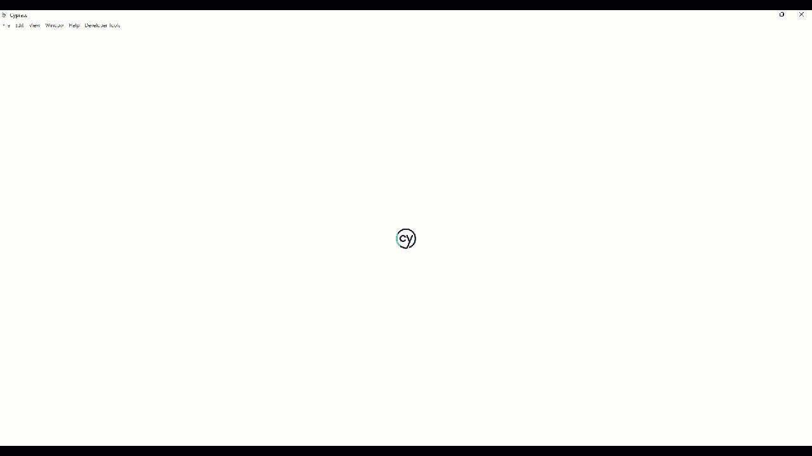

# 🚀 Projeto de Automação de Testes de API com Cypress

Este repositório contém a suíte de testes automatizados para a API JSONPlaceholder, desenvolvida com foco em qualidade, estabilidade e performance dos endpoints.

---

## 📋 Índice

- [📖 Sobre o Projeto](#-sobre-o-projeto)
- [💻 Tecnologias e Padrões](#-tecnologias-e-padrões)
- [🚦 Pré-requisitos](#-pré-requisitos)
- [⚙️ Instalação](#️-instalação)
- [🛠️ Configuração do Ambiente](#️-configuração-do-ambiente)
- [🏃 Execução dos Testes](#-execução-dos-testes)
- [🐛 Bugs encontrados](#-bugs-encontrados)
- [📂 Estrutura do Projeto](#-estrutura-do-projeto)
- [🙋 Sobre mim](#-sobre-mim)
- [✨ Contribuições](#-contribuições)

---

## 📖 Sobre o Projeto

Oiêe, meu nome é Thaisa Andrade! ✨

Esse projeto é o desafio 01 do processo seletivo para QA na PagueVeloz. A ideia aqui foi automatizar testes na API JSONPlaceholder, que é bastante usada para estudos e validações de testes de API.

O foco principal foi validar os retornos dos endpoints em termos de estrutura dos dados, status code e tempo de resposta, garantindo que tudo esteja funcionando certinho e dentro do esperado.

A suíte inclui também validações de performance e estrutura, deixando o projeto mais confiável e pronto para produção.

É isso! Espero que o projeto atenda a todos os requisitos e que vocês curtam tanto quanto eu curti desenvolver esse projeto 💛

---

## 💻 Tecnologias e Padrões

Este projeto foi desenvolvido utilizando boas práticas de automação de testes e tecnologias modernas:

- 🧪 **Cypress**: Framework principal para automação de testes de API
- 🎭 **Faker.js**: Geração de dados dinâmicos e massivos para evitar dados fixos e melhorar a cobertura
- 🔒 **Chai JSON Schema**: Validação de contrato das respostas, garantindo a consistência do schema
- 🏭 **Factories**: Implementação do padrão Factory para organização e manutenção dos dados de teste
- 🤹 **Comandos Customizados do Cypress**: Requisições complexas e reutilizáveis abstraídas para maior legibilidade
- 🌎 **Variáveis de Ambiente**: Configurações sensíveis e específicas por ambiente gerenciadas via cypress.config.js, permitindo flexibilidade e segurança

---

## 🚦 Pré-requisitos

Certifique-se de ter instalado em seu ambiente:

✅ Node.js v18.x ou superior ([nodejs.org](https://nodejs.org))  
✅ npm v9.x ou superior (vem junto com o Node.js)  
✅ Git (para clonar o repositório)

---

## ⚙️ Instalação

Clone este repositório:

```bash
git clone https://github.com/ThaisaAndrade2/desafio-pague-veloz
```

Navegue até a pasta do projeto:

```bash
cd desafio-pague-veloz/desafio-01-api
```

Instale as dependências:

```bash
npm install
```

---

## 🛠️ Configuração do Ambiente

As configurações específicas ficam no `cypress.config.js`:

```js
module.exports = {
  e2e: {
    baseUrl: 'https://jsonplaceholder.typicode.com',
    env: {
      responseTimeLimit: 500 // Limite de tempo em ms
    }
  }
}
```

---

## 🏃 Execução dos Testes

Para rodar especificamente os testes de API em modo headless:

```bash
npm run test:api
```

Para abrir a interface do Cypress e acompanhar os testes em tempo real:

```bash
npm run cy:open
```
#### ✨ Demonstração da Execução dos Testes:


---

## 🐛 Bugs Encontrados

[Veja aqui os bugs encontrados no projeto](./BUG_REPORT.md)

---

## 📂 Estrutura do Projeto

A estrutura de pastas foi organizada para facilitar a manutenção e localização dos arquivos:

```
📁 desafio-01-api
 ┣ 📁 assets                       
 ┃ ┗ 📄 demo.gif
 ┣ 📁 cypress                      
 ┃ ┣ 📁 downloads/                 
 ┃ ┣ 📁 e2e/
 ┃ ┃ ┗ 📁 api/                   
 ┃ ┃   ┗ 📄 api.cy.js
 ┃ ┣ 📁 evidences/                 
 ┃ ┃ ┣ 📄 bug01.png
 ┃ ┃ ┣ 📄 bug02.png
 ┃ ┃ ┣ 📄 bug03.png
 ┃ ┃ ┣ 📄 bug04.png
 ┃ ┃ ┣ 📄 bug05.png
 ┃ ┃ ┣ 📄 bug06.png
 ┃ ┃ ┣ 📄 bug07.png
 ┃ ┃ ┣ 📄 bug08.png
 ┃ ┃ ┗ 📄 bug09.png
 ┃ ┣ 📁 fixtures/
 ┃ ┃ ┗ 📁 schemas/                 
 ┃ ┃   ┣ 📄 post_comments_schema.json
 ┃ ┃   ┗ 📄 post_schema.json
 ┃ ┣ 📁 screenshots/                 
 ┃ ┗ 📁 support/
 ┃   ┣ 📁 factories/               
 ┃   ┃ ┗ 📄 factory.js
 ┃   ┣ 📄 commands.js              
 ┃   ┣ 📄 e2e.js                   
 ┃   ┗ 📄 helpers.js               
 ┣ 📁 node_modules/                  
 ┣ 📄 .gitignore                     
 ┣ 📄 BUG_REPORT.md                 
 ┣ 📄 cypress.config.js              
 ┣ 📄 package-lock.json             
 ┣ 📄 package.json                  
 ┗ 📄 README.md                      
```

---

## 🙋 Sobre mim

Esse projeto foi desenvolvido por mim **[Thaisa Andrade]**, para um processo seletivo.  
(Mandem energias positivas, estou bem animada 💃🏽🎉)

💼 Profissional de Qualidade de Software  
📬 Conecte-se comigo no [LinkedIn](https://www.linkedin.com/in/thaisa-andrade/)

---

## ✨ Contribuições

Contribuições são sempre bem-vindas!

Caso veja algo em que eu possa melhorar, abra uma issue ou envie um pull request com sugestões, melhorias ou correções.

---