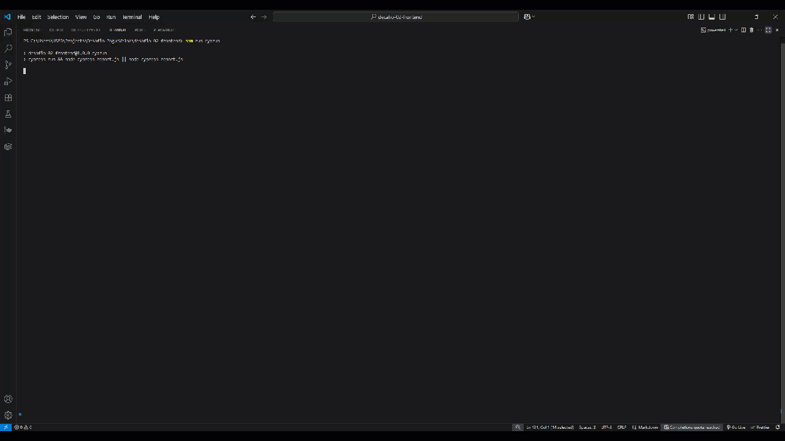
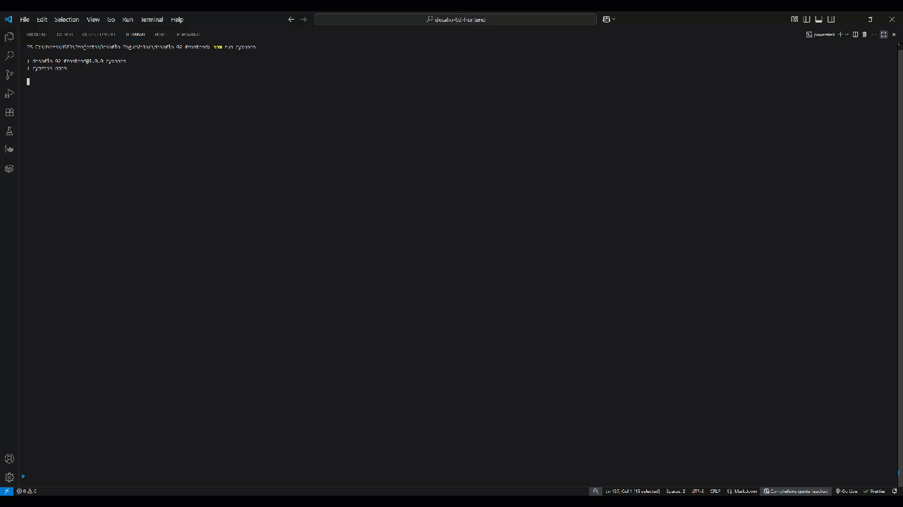
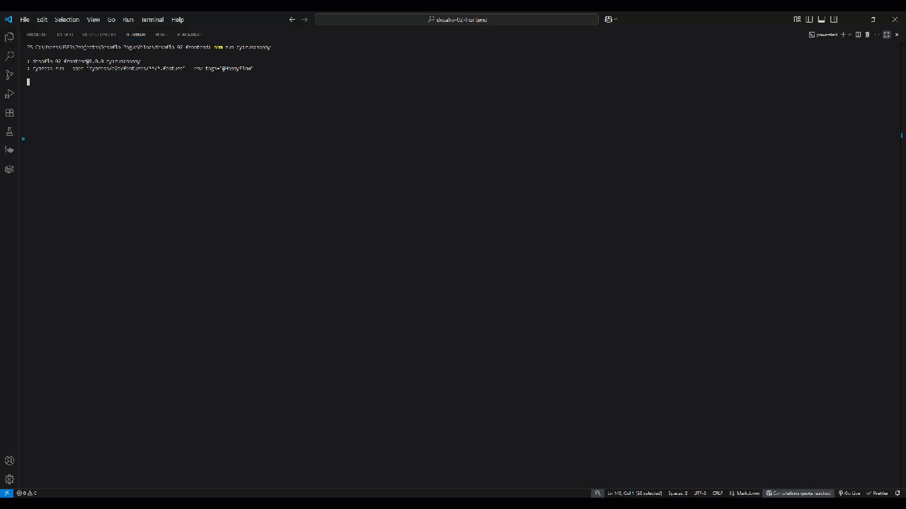
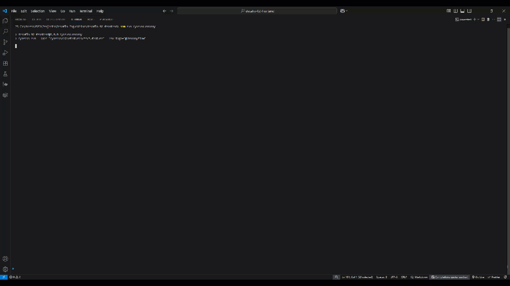

# 🚀 Projeto de Automação de Testes de UI com Cypress

Este repositório contém a suíte de testes automatizados para o site [Commit Quality](https://commitquality.com/), desenvolvida com foco em validação de funcionalidades de interface do usuário (UI), fluxo de navegação e interações de formulário.

---

## 📋 Índice

- [📖 Sobre o Projeto](#📖-sobre-o-projeto)
- [💻 Tecnologias e Padrões](#💻-tecnologias-e-padrões)
- [🚦 Pré-requisitos](#🚦-pré-requisitos)
- [⚙️ Instalação](#⚙️-instalação)
- [🛠️ Configuração do Ambiente](#🛠️-configuração-do-ambiente)
- [🏃 Execução dos Testes](#🏃-execução-dos-testes)
- [📄 Cenários de Teste Detalhados](#📄-cenários-de-teste-detalhados)
- [💡 Pontos de Melhoria Identificados](#💡-pontos-de-melhoria-identificados)
- [📂 Estrutura do Projeto](#📂-estrutura-do-projeto)
- [🙋 Sobre mim](#🙋-sobre-mim)
- [✨ Contribuições](#✨-contribuições)

---

## 📖 Sobre o Projeto

Oiêee, voltei com a parte mais desafiadora! ✨

Meu nome é Thaisa Andrade.

Esse projeto é o desafio 02 do processo seletivo para QA na PagueVeloz. A ideia aqui foi automatizar testes de UI no site [Commit Quality](https://commitquality.com/), que simula um sistema de gerenciamento de produtos.

O foco principal foi validar as interações do usuário com a interface, incluindo:

- Navegação entre as páginas (Home, Add Product, Login, etc.).
- Preenchimento e validação de formulários (cadastro de produtos, login).
- Funcionalidades de busca e filtro de produtos.
- Interações de elementos dinâmicos.
- Validação de mensagens de erro e feedback ao usuário.

O objetivo é garantir que a aplicação se comporte conforme o esperado, proporcionando uma experiência de usuário fluida e sem falhas.

Gostaria de ter explorado mais algumas páginas e funcionalidades, mas decidi focar na profundidade das validações existentes. Meu plano é continuar desenvolvendo e melhorando este projeto futuramente!

✨ Espero que o projeto atenda a todos os requisitos e que vocês curtam tanto quanto eu curti desenvolver esse projeto 💛

---

## 💻 Tecnologias e Padrões

Este projeto foi desenvolvido utilizando boas práticas de automação de testes e tecnologias modernas:

- 🧪 **Cypress:** Framework principal para automação de testes de UI.
- 🎭 **Faker.js:** Geração de dados dinâmicos para preenchimento de formulários e cenários de teste.
- 🌳 **Cypress Cucumber Preprocessor:** Para escrever testes em Gherkin (BDD), tornando os cenários mais legíveis e colaborativos.
- 🏭 **Factories:** Implementação do padrão Factory para organização e manutenção dos dados de teste (ex: dados de produtos, dados de login).
- 🤹 **Comandos Customizados do Cypress:** Abstração de interações complexas e reutilizáveis para maior legibilidade e manutenção dos steps.
- 🗺️ **Mapeamentos (Mappings):** Centralização de seletores de elementos e mensagens de erro para facilitar a manutenção da UI.
- 🌎 **Variáveis de Ambiente:** Configurações específicas por ambiente gerenciadas via `cypress.config.js`.

---

## 🚦 Pré-requisitos

Certifique-se de ter instalado em seu ambiente:

- ✅ Node.js v18.x ou superior ([nodejs.org](https://nodejs.org))
- ✅ npm v9.x ou superior (vem junto com o Node.js)
- ✅ Git (para clonar o repositório)
- ✅ Faker.js (instalado via npm, como dependência do projeto)
- ✅ Cypress Cucumber Preprocessor (instalado via npm, como dependência do projeto)

---

## ⚙️ Instalação

Clone este repositório:

```bash
git clone https://github.com/ThaisaAndrade2/desafio-pague-veloz
```

Navegue até a pasta do projeto (certifique-se de estar na pasta do projeto de UI):

```bash
cd desafio-pague-veloz/desafio-02-frontend
```

Instale as dependências:

```bash
npm install
```

---

## 🛠️ Configuração do Ambiente

As configurações específicas ficam no `cypress.config.js`:

```js
const { defineConfig } = require("cypress");
const createBundler = require("@bahmutov/cypress-esbuild-preprocessor");
const { addCucumberPreprocessorPlugin } = require("@badeball/cypress-cucumber-preprocessor");
const { createEsbuildPlugin } = require("@badeball/cypress-cucumber-preprocessor/esbuild");

module.exports = defineConfig({
  e2e: {
    baseUrl: "https://commitquality.com",
    specPattern: "**/*.feature",
    async setupNodeEvents(on, config) {
      await addCucumberPreprocessorPlugin(on, config);
      on(
        "file:preprocessor",
        createBundler({
          plugins: [createEsbuildPlugin(config)],
        })
      );
      return config;
    },
  },
});
```

---

## 🏃 Execução dos Testes

Para rodar todos os testes em modo headless (terminal):

```bash
npm run cy:run
```

Para abrir a interface do Cypress e acompanhar os testes em tempo real (modo interativo):

```bash
npm run cy:open
```

### Comandos de Execução por Tags

Executar cenários com a tag `@HappyFlow`:

```bash
npm run cy:run:happy
```

Executar cenários com a tag `@UnhappyFlow`:

```bash
npm run cy:run:unhappy
```

#### Como configurar os comandos no `package.json`:

```json
{
  "scripts": {
    "cy:run": "cypress run && node cypress-report.js || node cypress-report.js",
    "cy:open": "cypress open",
    "cy:run:happy": "cypress run --spec \"cypress/e2e/features/**/*.feature\" --env tags=\"@HappyFlow\"",
    "cy:run:unhappy": "cypress run --spec \"cypress/e2e/features/**/*.feature\" --env tags=\"@UnhappyFlow\""
  }
}
```

---

## 📄 Cenários de Teste Detalhados

Um dos requisitos do desafio era criar uma documentação com os cenários de teste implementados. Essa documentação está disponível no arquivo [cenarios.txt](./cenarios.txt), localizado na raiz do projeto.

> 📌 **Observação:** Este arquivo contém a descrição detalhada dos fluxos testados, exemplos de dados e critérios de validação para facilitar a análise técnica.


---

## 💡 Pontos de Melhoria Identificados

Durante o desenvolvimento e execução dos testes, percebi vários pontos de melhoria e oportunidades de expansão. Vale lembrar que essa é uma UI feita para testes, então sempre vai ter espaço para melhorias mas já está ótima para praticar e treinar automação. 💛

### [Login]

O fluxo de login pode ser expandido para cobrir diferentes cenários e melhorar a experiência do usuário:

- **Validar login com sucesso:** Confirmar que o sistema permite acesso ao usuário ao inserir username e password corretos, redirecionando para a página principal e exibindo mensagem de boas-vindas ou dashboard.
- **Validar login com username correto e senha incorreta:** Verificar se o sistema bloqueia o acesso e exibe mensagem de erro clara informando senha inválida.
- **Validar login com username incorreto e senha correta:** Garantir que o sistema não autentica e exibe mensagem informando usuário não encontrado ou inválido.
- **Validar opção de reset de senha:** Testar o fluxo de recuperação de senha, garantindo que o usuário receba as instruções por e-mail e consiga redefinir com sucesso.
- **Validar opção de cadastro inicial:** Confirmar que usuários novos conseguem se cadastrar no sistema e, após cadastro, realizar login com sucesso.
- **Validar mensagens de erro específicas para campos obrigatórios:** Testar que ao tentar login sem preencher o username ou password, o sistema exibe mensagens de erro individualizadas para cada campo, além da mensagem geral de erro.

---

### [Products - Add a Product]

A funcionalidade de adicionar produtos pode ser aprimorada para maior organização, segurança e clareza:

- **Adicionar path `/products`:** Melhorar a estrutura de rotas criando um caminho dedicado para listagem de produtos, por exemplo, `https://commitquality.com/products`.
- **Permitir adicionar produtos apenas para usuários autenticados:** Restringir o acesso ao formulário de cadastro de produtos, garantindo que apenas usuários logados possam adicionar novos itens.
- **Incluir descrição curta em cada produto:** Adicionar um campo de descrição curta no cadastro de produtos para exibir informações resumidas na listagem, facilitando o entendimento da proposta de valor do produto.
- **Agrupar produtos por categorias:** Implementar o cadastro de categorias e organizar a listagem agrupando os produtos, permitindo ao usuário filtrar e encontrar itens de forma mais rápida.
- **Remover ou editar:** Seria legal ter essas ações para validar interações básicas, como excluir ou atualizar produtos, deixando os testes ainda mais completos.

---

## 📂 Estrutura do Projeto
```
📁 desafio-02-frontend
┣ 📁 assets
┃ ┣ 📄 demo-01.gif
┃ ┣ 📄 demo-02.gif
┃ ┣ 📄 demo-03.gif
┃ ┗ 📄 demo-04.gif
┣ 📁 cypress
┃ ┣ 📁 e2e
┃ ┃ ┣ 📁 features
┃ ┃ ┃ ┣ 📄 adicionar_produto.feature
┃ ┃ ┃ ┣ 📄 busca_produto.feature
┃ ┃ ┃ ┣ 📄 login.feature
┃ ┃ ┃ ┗ 📄 navegacao.feature
┃ ┃ ┣ 📁 steps
┃ ┃ ┃ ┣ 📄 adicionar_produto.js
┃ ┃ ┃ ┣ 📄 busca_produto.js
┃ ┃ ┃ ┗ 📄 login.js
┃ ┣ 📁 reports
┃ ┃ ┣ 📁 cucumber-html-report
┃ ┃ ┗ 📄 relatorio.json
┃ ┣ 📁 screenshots
┃ ┗ 📁 support
┃ ┃ ┣ 📁 factories
┃ ┃ ┣ 📄 e2e.js
┃ ┃ ┣ 📄 helpers.js
┃ ┃ ┗ 📄 mappings.js
┣ 📁 node_modules
┣ 📄 .cypress-cucumber-preprocessorc.json
┣ 📄 .gitignore
┣ 📄 cenarios.txt
┣ 📄 cypress-report.js
┣ 📄 cypress.config.js
┣ 📄 package-lock.json
┣ 📄 package.json
┗ 📄 README.md
```
---

## 🙋 Sobre mim

Esse projeto foi desenvolvido por mim, Thaisa Andrade, para um processo seletivo ✨

Automação de testes de UI foi um desafio e tanto, mas o tanto que aprendi nessa semana não está escrito! Estou muito feliz com o resultado dos desafios 01 (API) e 02 (UI), mesmo sabendo que ainda tem várias melhorias para fazer. Essa jornada só me animou ainda mais com a área de automação, mostrando que tenho muito a aprender e a contribuir.

📬 [Conecte-se comigo no LinkedIn](https://www.linkedin.com/in/thaisa-andrade/)

---

## ✨ Contribuições

Sua contribuição é o combustível para a evolução deste projeto! 🚀

Se você identificou uma oportunidade de melhoria, encontrou um bug que passou despercebido, ou tem uma ideia brilhante para expandir as funcionalidades, não hesite em colaborar! Abra uma issue detalhada ou envie um pull request com suas sugestões ou melhorias.

Toda e qualquer contribuição é extremamente valorizada e fundamental para construirmos um projeto cada vez mais robusto e completo. Juntos, podemos ir muito além!

---
